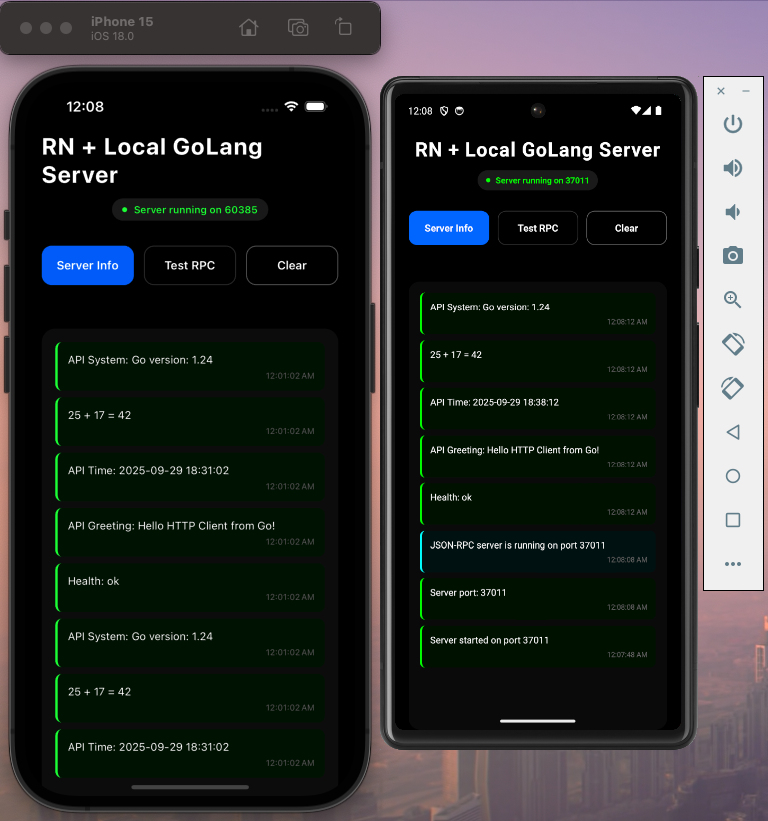

# React Native + Go Backend



A React Native application demonstrating communication with a local Go HTTP server using JSI and JSON-RPC 2.0.

## Overview

This project showcases how to build a fast mobile application where:
- React Native handles the UI with the New Architecture (Fabric + TurboModules)
- Go runs as an embedded HTTP server providing JSON-RPC APIs
- Native modules manage the Go server lifecycle
- Business logic is handled via JSON-RPC calls over HTTP

## Prerequisites

- Node.js 18+
- Go 1.24+
- gomobile: `go install golang.org/x/mobile/cmd/gomobile@latest`
- iOS: Xcode 15+, CocoaPods
- Android: Android Studio, JDK 17+

## Quick Start

### Setup Build Environment

First time setup (installs gomobile and required dependencies):
```bash
cd backend
make setup
```

### Build Go Backend

iOS:
```bash
cd backend
make ios
```

Android:
```bash
cd backend
make android
```

You can also run `make help` in the backend directory to see all available targets.

### Run the App

iOS:
```bash
cd mobile-app
npm install
npx pod-install
npx expo run:ios
```

Android:
```bash
cd mobile-app
npm install
npx expo run:android
```

## Project Structure

```
react-native-go/
├── backend/
│   ├── mobile_api.go      # Mobile API for server lifecycle
│   ├── http_server.go     # JSON-RPC HTTP server
│   └── Makefile
└── mobile-app/
    ├── src/
    │   ├── NativeGoServerBridge.ts    # TurboModule spec
    │   ├── GoServerBridgeJSI.ts       # JSI wrapper
    │   └── JsonRpcClient.ts           # JSON-RPC client
    ├── android/               # Android native code
    └── ios/                   # iOS native code
```

## How It Works

### Native Layer (TurboModule)

The native modules expose 3 synchronous methods via JSI:

```typescript
interface Spec extends TurboModule {
  readonly startServer: () => number;    // Returns port number
  readonly stopServer: () => boolean;    // Returns success status
  readonly getServerPort: () => number;  // Gets current port
}
```

### Go Backend Layer

The Go backend provides a mobile API for lifecycle management:

```go
type MobileAPI struct{}

func (m *MobileAPI) StartServer() int {
    return StartHTTPServer()
}

func (m *MobileAPI) StopServer() {
    StopHTTPServer()
}

func (m *MobileAPI) GetServerPort() int {
    return GetHTTPServerPort()
}
```

And handles business logic via JSON-RPC:

```go
func (s *HTTPServer) handleRequest(req JSONRPCRequest) JSONRPCResponse {
    switch req.Method {
    case "getGreeting":
        // Handle business logic
    case "getCurrentTime":
        // Handle business logic
    }
}
```

### JavaScript/TypeScript Layer

Start the server and make JSON-RPC calls:

```typescript
import GoBridge from './GoServerBridgeJSI';

const port = GoBridge.startServer();
const client = new JsonRpcClient(`http://localhost:${port}`);
const result = await client.call('getGreeting', { name: 'World' });
```

## Adding New API Endpoints

To add a new endpoint, modify only the Go backend:

```go
// In backend/http_server.go
case "myNewMethod":
    params, ok := req.Params.(map[string]interface{})
    if !ok {
        return s.errorResponse(req.ID, -32602, "Invalid params")
    }
    result := doSomething(params)
    return JSONRPCResponse{JSONRPC: "2.0", Result: result, ID: req.ID}
```

Use from React Native:

```typescript
const result = await jsonRpcClient.call('myNewMethod', { param: 'value' });
```

No native code changes required.

## Common Issues

### gomobile not found
```bash
export PATH=$PATH:$(go env GOPATH)/bin
gomobile init
```

### Cannot find Gobridge.xcframework
```bash
cd backend
make ios
```

### Cannot find gobridge.aar
```bash
cd backend
make android
```


## Development Workflow

### Changes to Go Code
1. Edit backend/*.go files
2. Rebuild: `cd backend && make ios` or `make android`
3. Rebuild app: `cd mobile-app && npx expo run:ios` or `npx expo run:android`

## License

This project is licensed under the MIT License - see the [LICENSE](LICENSE) file for details.

## Show Your Support

If this project helped you, please give it a [star](https://github.com/siddarthkay/react-native-go/star)! ⭐

## Support

- **Issues**: [GitHub Issues](https://github.com/siddarthkay/react-native-go/issues)

## Acknowledgments
- [React Native](https://reactnative.dev/) - Learn once, write anywhere
- [Expo](https://expo.dev/) - Platform for universal React applications
- [go-mobile](https://pkg.go.dev/golang.org/x/mobile) - Go bindings for mobile
- [status-mobile](https://github.com/status-im/status-mobile) - Real-world Clojure/Go integration
---
