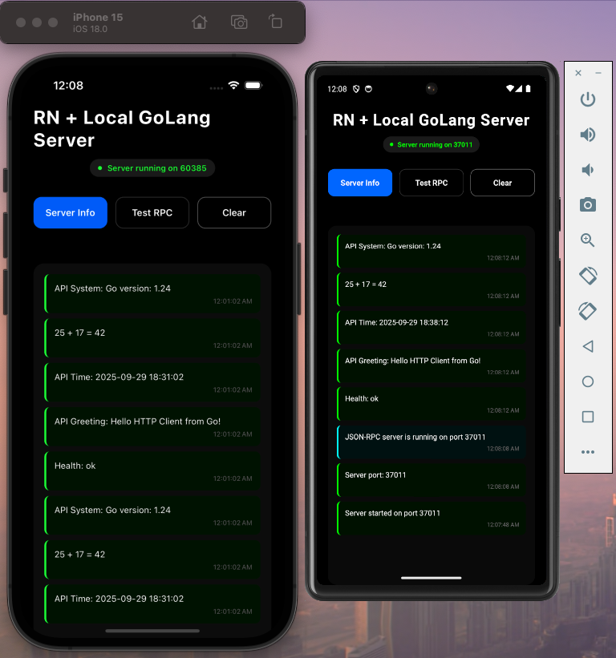

# React Native + Go Backend

<p align="center">
  
</p>

<p align="center">
  
</p>

A React Native application demonstrating communication with a local Go HTTP server using JSI and JSON-RPC 2.0.

## Overview

This project showcases how to build a fast mobile application where:
- React Native handles the UI with the New Architecture (Fabric + TurboModules)
- Go runs as an embedded HTTP server providing JSON-RPC APIs
- Native modules manage the Go server lifecycle
- Business logic is handled via JSON-RPC calls over HTTP

## Prerequisites

- Node.js 18+
- Yarn 4 (via Corepack): `corepack enable`
- Go 1.25+
- iOS: Xcode 15+, CocoaPods
- Android: Android Studio, JDK 17+

## Quick Start

### Setup

Install Go toolchain (gomobile) and Node dependencies:
```bash
make setup
```

### Build & Run

iOS:
```bash
make ios
```

Android:
```bash
make android
```

Run `make help` to see all available targets. Each sub-project also has its own Makefile:
```bash
make -C backend help
make -C mobile-app help
```

### Development Mode

For iterative development with hot reload:
```bash
cd mobile-app
yarn ios    # or yarn android
```

## Project Structure

```
react-native-go/
├── Makefile                        # Root orchestrator
├── backend/
│   ├── Makefile                    # Go build targets
│   ├── mobile_api.go               # Mobile API for server lifecycle
│   └── http_server.go              # JSON-RPC HTTP server
└── mobile-app/
    ├── Makefile                    # Mobile build targets
    ├── src/
    │   ├── NativeGoServerBridge.ts # TurboModule spec
    │   ├── GoServerBridgeJSI.ts    # JSI wrapper
    │   └── JsonRpcClient.ts        # JSON-RPC client
    ├── android/                    # Android native code
    └── ios/                        # iOS native code
```

## How It Works

### Native Layer (TurboModule)

The native modules expose 3 synchronous methods via JSI:

```typescript
interface Spec extends TurboModule {
  readonly startServer: () => number;
  readonly stopServer: () => boolean;
  readonly getServerPort: () => number;
}
```

### Go Backend Layer

The Go backend provides a mobile API for lifecycle management:

```go
type MobileAPI struct{}

func (m *MobileAPI) StartServer() int {
    return StartHTTPServer()
}

func (m *MobileAPI) StopServer() {
    StopHTTPServer()
}

func (m *MobileAPI) GetServerPort() int {
    return GetHTTPServerPort()
}
```

And handles business logic via JSON-RPC:

```go
func (s *HTTPServer) handleRequest(req JSONRPCRequest) JSONRPCResponse {
    switch req.Method {
    case "getGreeting":
    case "getCurrentTime":
    }
}
```

### JavaScript/TypeScript Layer

Start the server and make JSON-RPC calls:

```typescript
import GoBridge from './GoServerBridgeJSI';

const port = GoBridge.startServer();
const client = new JsonRpcClient(`http://localhost:${port}`);
const result = await client.call('getGreeting', { name: 'World' });
```

## Adding New API Endpoints

To add a new endpoint, modify only the Go backend:

```go
case "myNewMethod":
    params, ok := req.Params.(map[string]any)
    if !ok {
        return s.errorResponse(req.ID, -32602, "Invalid params")
    }
    result := doSomething(params)
    return JSONRPCResponse{JSONRPC: "2.0", Result: result, ID: req.ID}
```

Use from React Native:

```typescript
const result = await jsonRpcClient.call('myNewMethod', { param: 'value' });
```

No native code changes required.

## Common Issues

### gomobile not found
```bash
export PATH=$PATH:$(go env GOPATH)/bin
```
Or run `make setup` from the project root which installs gomobile automatically.

### Cannot find Gobridge.xcframework
```bash
make -C backend ios
```

### Cannot find gobridge.aar
```bash
make -C backend android
```

## Development Workflow

### Changes to Go Code
1. Edit `backend/*.go` files
2. Rebuild and run: `make ios` or `make android`

### Changes to JS/TS Code
Hot reload handles this automatically when running in development mode.

## License

This project is licensed under the MIT License - see the [LICENSE](LICENSE) file for details.

## Show Your Support

If this project helped you, please give it a [star](https://github.com/siddarthkay/react-native-go/star)! ⭐

## Support

- **Issues**: [GitHub Issues](https://github.com/siddarthkay/react-native-go/issues)

## Acknowledgments
- [React Native](https://reactnative.dev/) - Learn once, write anywhere
- [Expo](https://expo.dev/) - Platform for universal React applications
- [go-mobile](https://pkg.go.dev/golang.org/x/mobile) - Go bindings for mobile
- [status-mobile](https://github.com/status-im/status-mobile) - Real-world Clojure/Go integration
---
